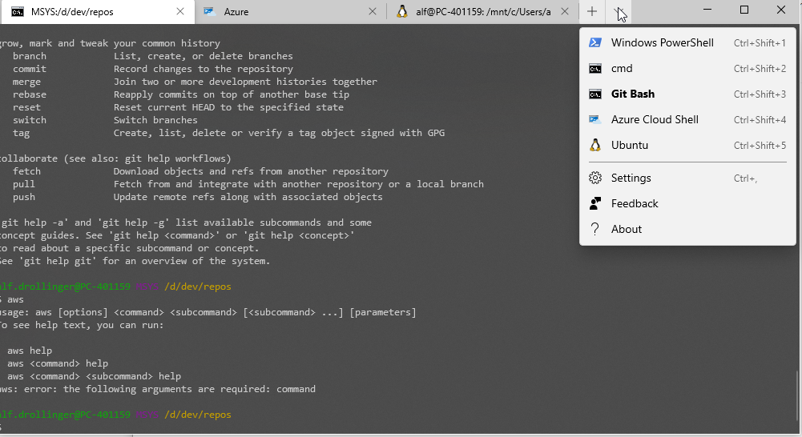

# Windows dotfiles

Most of the time I work on Windows 10. There are some useful scripts and configurations I want to share with webdevelopers working on Windows.

## profiles.json for Microsoft Terminal

I love Microsoft Terminal. One config-file and one open window to hack them all. I added Git Bash as my default, Ubuntu (WSL) and Azure Shell. Powershell and the good ol' command-prompt are available by default. AWS Cli integrates perfectly. After installing the 64-bit version the aws-command is available in Git Bash and Powershell.

## W-I-P

See https://gist.github.com/mehulmpt/16826be279bb9bf70310b465ca9c5de3 for better styles.
